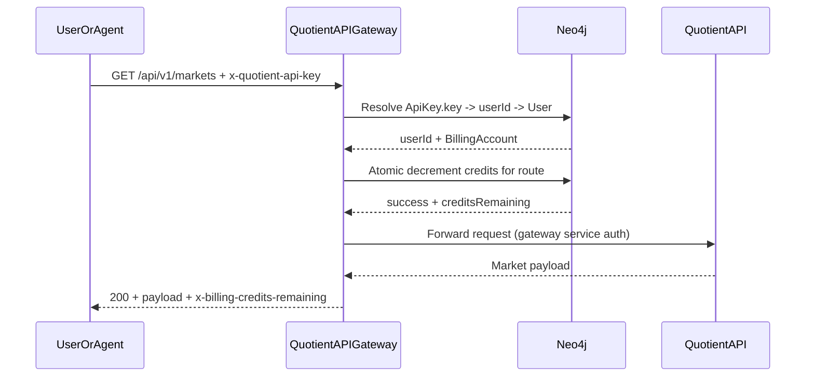
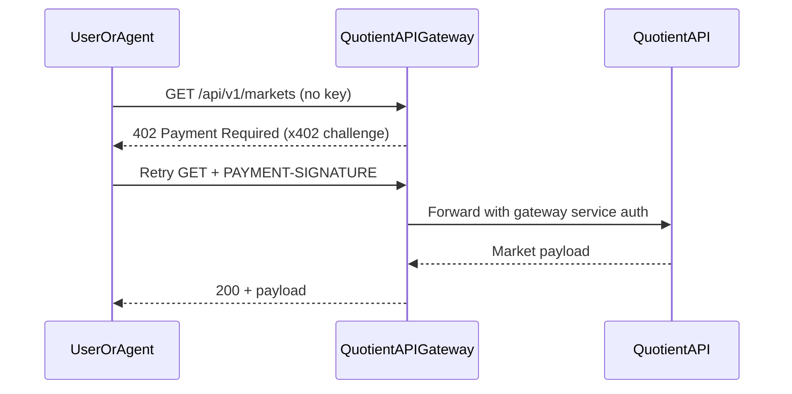
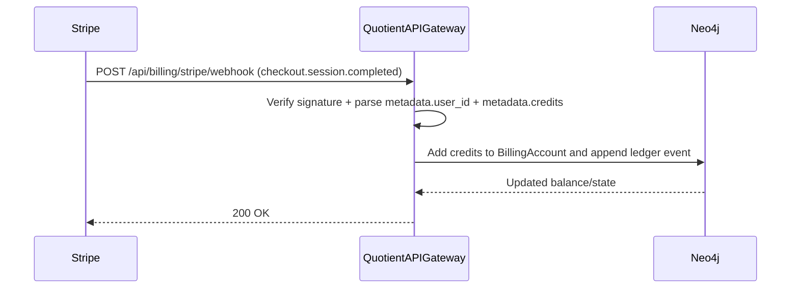

# Quotient API Gateway

x402-style monetization and policy gateway in front of `quotient-api`.

## What it does

- Returns `402 Payment Required` for protected routes when payment proof is missing.
- Proxies read endpoints (`/api/v1/markets*`) to Quotient API.
- Supports dual-path access:
  - user key via `x-quotient-api-key` for credit-balance metering in the gateway
  - x402 paid fallback via `PAYMENT-SIGNATURE` when key is missing
- Authenticates upstream to `quotient-api` using gateway service auth (`x-quotient-gateway-secret`).
- Handles Stripe credit purchase webhook events at `/api/billing/stripe/webhook`.
- Exposes internal checkout/session endpoints for portal orchestration:
  - `GET /api/internal/billing/plans`
  - `POST /api/internal/billing/checkout-session`
  - `GET /api/internal/billing/checkout-session/status?sessionId=...`
  - `GET/POST /api/internal/billing/auto-recharge`
- Serves a public gateway skill artifact at `/public/skills/quotient-api-gateway/SKILL.md`.

## Route Pricing Policy

Monetized public route policy is centralized in `src/billing/config.ts` via a single registry resolver.

- Each monetized route entry defines both:
  - credit cost
  - x402 amount
- Gateway billing and x402 challenge logic both resolve from this same policy.
- Strict mode is enforced: if a `/api/v1/*` route has no policy entry, gateway returns `422 unpriced_route`.
- Public pricing view is exposed at `GET /api/public/pricing` for docs/portal consumers.

## x402 Headers

- Client sends payment proof in `PAYMENT-SIGNATURE`.
- Gateway returns challenge metadata in `PAYMENT-REQUIRED` for `402` responses.
- Gateway returns settlement metadata in `PAYMENT-RESPONSE` after successful paid requests.

## Quickstart

```bash
cp .env.example .env
npm install
npm run build
node dist/server.js
```

Server starts at `http://localhost:3001` by default.

## Request Sequence Diagrams

### 1) Valid key + active credits



### 2) Missing key with x402 fallback



### 3) Stripe purchase adds credits



## Required environment variables

- `QUOTIENT_API_BASE_URL` (example: `http://localhost:3000`)
- `QUOTIENT_GATEWAY_SHARED_SECRET` (must match `quotient-api`)
- `QUOTIENT_INTERNAL_SERVICE_TOKEN` (must match `quotient-api`; used for internal checkout/provision calls)
- `X402_FACILITATOR_URL`
- `X402_ENABLED_NETWORKS` (CAIP-2 list, e.g. `eip155:84532,eip155:8453`)
- `X402_PAY_TO_EIP155_84532`, `X402_PAY_TO_EIP155_8453`
- `STRIPE_SECRET_KEY`, `STRIPE_WEBHOOK_SECRET`
- `STRIPE_CHECKOUT_SUCCESS_URL`, `STRIPE_CHECKOUT_CANCEL_URL`
- `NEO4J_URI`, `NEO4J_USER`, `NEO4J_PASS` (required)

See `.env.example` for full list.

## Local E2E

Detailed instructions: [Local E2E Testing](docs/local-e2e-testing.md).

Quick run:

```bash
export TEST_API_KEY=qt_your_real_key
npm run e2e:test-api-key
```

Automated x402 paid request flow:

```bash
export TEST_X402_PRIVATE_KEY=0xyour_test_wallet_private_key
export TEST_X402_NETWORK=eip155:84532
npm run e2e:test-x402-payment
```

## Stripe Setup Runbook

See [Stripe Registration Runbook](docs/stripe-registration-runbook.md).

## Stripe Webhook Events

Configure your Stripe webhook endpoint (`POST /api/billing/stripe/webhook`) to subscribe to:

- `checkout.session.completed`
- `payment_intent.succeeded`

These are the events used for credit grants (manual purchase and auto-recharge). Other Stripe events are ignored with `200`.

## Stripe Credit Unit Onboarding Checklist

The gateway now expects a single Stripe unit price for credit purchases.
Users choose integer dollar units at checkout/auto-recharge time, with a minimum of 5 units.
Credits granted are computed as:

- `units * credits_per_dollar`

To configure the Stripe unit item:

1. Create (or update) one Stripe product and one-time price at exactly `$1.00 USD`.
2. On the product metadata, set:
   - `catalog=quotient_api_credits` (hardcoded gateway catalog filter)
   - required: `pack_id=<stable_pack_id>` (mandatory for reloads)
   - `credits=<positive integer>` (credits granted per $1 unit)
3. Ensure the price is active + one-time and in `usd`.
4. Restart gateway (or wait for the 300-second plan cache TTL), then verify:
   - call `GET /api/internal/billing/plans` with internal bearer token
   - confirm the discovered unit item has `amountUsd=1` and expected `credits`

## x402 Rollout Phases

1. Enable `X402_ENABLED_NETWORKS=eip155:84532` in test environment and verify paid retries with `PAYMENT-SIGNATURE`.
2. Validate idempotent retries using `payment-identifier` (same id returns cached settlement headers).
3. Enable limited production traffic on Base Sepolia or shadow traffic.
4. Add `eip155:8453` and `X402_PAY_TO_EIP155_8453` for full Base mainnet rollout.
