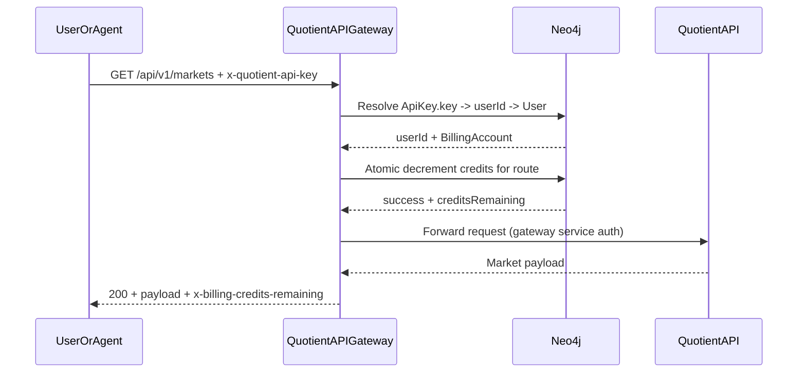
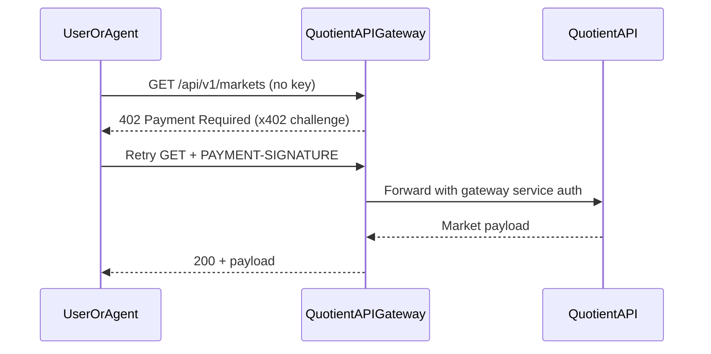
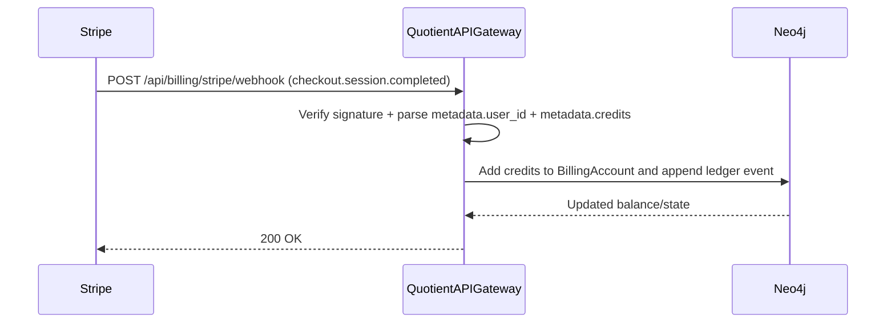

# Quotient API Gateway

x402 monetization and policy gateway in front of `quotient-api`.

## Repo Relationship

`quotient-api-gateway` is the public payable edge. `quotient-api` is the canonical contract authoring repo.

- Canonical payable contract source: API OpenAPI (`/openapi.json`).
- Gateway loads that contract and enforces it at runtime.
- Gateway refreshes contract by:
  - pulling canonical OpenAPI at startup + interval,
  - accepting push sync from API startup via internal endpoint.

## What the Gateway Does

- Returns `402 Payment Required` for protected routes when payment proof is missing.
- Proxies public intelligence endpoints to upstream API.
- Supports dual access:
  - `x-quotient-api-key` credits path
  - x402 paid fallback (`PAYMENT-SIGNATURE`)
- Authenticates upstream calls with `x-quotient-gateway-secret`.
- Exposes billing and checkout orchestration endpoints.
- Serves discovery endpoints on the gateway origin:
  - `/openapi.json` (canonical machine contract surface)
  - `/.well-known/x402`
  - `/llms.txt`, `/skill/skill.md`, `/skill/references/*` (proxied)

## Canonical Pricing and Policy Source

- Gateway pricing and route policy are **not hardcoded**.
- They are derived from canonical API OpenAPI `x-payment-info` metadata.
- Public pricing endpoint:
  - `GET /api/public/pricing`
  - derived from in-memory canonical policy snapshot.
- If a `/api/v1/*` request is not represented in loaded payable policy, gateway returns `422 unpriced_route`.

## Key Files

- Canonical contract parsing + validation + resolver:
  - `src/billing/contract.ts`
- Runtime x402 challenge/settlement route declarations:
  - `src/billing/x402.ts`
- Gateway routing, discovery surfaces, sync endpoints, refresh loop:
  - `src/server.ts`
- Billing storage and Stripe integration:
  - `src/billing/store.ts`
  - `src/billing/stripe.ts`

## Contract Sync Model

- Pull:
  - Gateway loads from `QUOTIENT_CANONICAL_OPENAPI_URL` (or `${QUOTIENT_API_BASE_URL}/api/v1/openapi.json`) on startup.
  - Gateway periodically refreshes (`QUOTIENT_CONTRACT_REFRESH_INTERVAL_MS`, default 60s).
- Push:
  - API startup posts canonical OpenAPI to:
    - `POST /api/internal/discovery/contract-sync`
  - Auth required:
    - `Authorization: Bearer ${QUOTIENT_INTERNAL_SERVICE_TOKEN}`

## x402 Headers

- Client payment proof: `PAYMENT-SIGNATURE`
- Gateway challenge metadata (on `402`): `PAYMENT-REQUIRED`
- Settlement metadata (on success): `PAYMENT-RESPONSE`

## Quickstart

```bash
cp .env.example .env
npm install
npm run build
node dist/server.js
```

Server starts at `http://localhost:3001` by default.

## Request Sequence Diagrams

### 1) Valid key + active credits



### 2) Missing key with x402 fallback



### 3) Stripe purchase adds credits



## Required Environment Variables

- `QUOTIENT_API_BASE_URL` (example: `http://localhost:3000`)
- `QUOTIENT_GATEWAY_SHARED_SECRET` (must match `quotient-api`)
- `QUOTIENT_INTERNAL_SERVICE_TOKEN` (must match `quotient-api`; used for internal checkout/provision calls)
- `QUOTIENT_CANONICAL_OPENAPI_URL` (optional override; default derives from `QUOTIENT_API_BASE_URL`)
- `QUOTIENT_CONTRACT_REFRESH_INTERVAL_MS` (optional; default `60000`)
- `X402_FACILITATOR_URL`
- `X402_ENABLED_NETWORKS` (CAIP-2 list, e.g. `eip155:84532,eip155:8453`)
- `X402_PAY_TO_EIP155_84532`, `X402_PAY_TO_EIP155_8453`
- `STRIPE_SECRET_KEY`, `STRIPE_WEBHOOK_SECRET`
- `STRIPE_CHECKOUT_SUCCESS_URL`, `STRIPE_CHECKOUT_CANCEL_URL`
- `NEO4J_URI`, `NEO4J_USER`, `NEO4J_PASS` (required)

See `.env.example` for full list.

## Adding or Updating a Payable Endpoint

Canonical definition lives in API repo. Process:

1. In `quotient-api`, add/update endpoint implementation and canonical OpenAPI operation.
2. In API OpenAPI operation, ensure:
   - `x-payment-info` is present and valid,
   - `responses["402"]` is `Payment Required`,
   - request input schema is present.
3. Deploy/update API.
4. Gateway picks up update via startup sync push and periodic pull.
5. Validate on gateway origin:
   - `/openapi.json`
   - `/.well-known/x402`
   - `/api/public/pricing`
   - runtime `402` flow.

## Testing and Deployment Workflow

Gateway local checks:

```bash
npm install
npm run typecheck
npm test
```

Cross-repo integration checks:

1. Start API and gateway with shared secrets/tokens.
2. Confirm contract sync succeeds (push and/or pull).
3. Verify discovery:
   - `npx -y @agentcash/discovery@latest discover "$GATEWAY_ORIGIN"`
4. Verify runtime:
   - API key path (`e2e:test-api-key`)
   - x402 path (`e2e:test-x402-payment`)

## Local E2E

Detailed instructions: [Local E2E Testing](docs/local-e2e-testing.md).

Quick run:

```bash
export TEST_API_KEY=qt_your_real_key
npm run e2e:test-api-key
```

Automated x402 paid request flow:

```bash
export TEST_X402_PRIVATE_KEY=0xyour_test_wallet_private_key
export TEST_X402_NETWORK=eip155:84532
npm run e2e:test-x402-payment
```

## Stripe Setup Runbook

See [Stripe Registration Runbook](docs/stripe-registration-runbook.md).

## Stripe Webhook Events

Configure your Stripe webhook endpoint (`POST /api/billing/stripe/webhook`) to subscribe to:

- `checkout.session.completed`
- `payment_intent.succeeded`

These are the events used for credit grants (manual purchase and auto-recharge). Other Stripe events are ignored with `200`.

## Stripe Credit Unit Onboarding Checklist

The gateway now expects a single Stripe unit price for credit purchases.
Users choose integer dollar units at checkout/auto-recharge time, with a minimum of 100 units ($100).
Credits granted are computed as:

- `units * credits_per_dollar`

To configure the Stripe unit item:

1. Create (or update) one Stripe product and one-time price at exactly `$1.00 USD`.
2. On the product metadata, set:
   - `catalog=quotient_api_credits` (hardcoded gateway catalog filter)
   - required: `pack_id=<stable_pack_id>` (mandatory for reloads)
   - `credits=<positive integer>` (credits granted per $1 unit)
3. Ensure the price is active + one-time and in `usd`.
4. Restart gateway (or wait for the 300-second plan cache TTL), then verify:
   - call `GET /api/internal/billing/plans` with internal bearer token
   - confirm the discovered unit item has `amountUsd=1` and expected `credits`

## x402 Rollout Phases

1. Enable `X402_ENABLED_NETWORKS=eip155:84532` in test environment and verify paid retries with `PAYMENT-SIGNATURE`.
2. Validate idempotent retries using `payment-identifier` (same id returns cached settlement headers).
3. Enable limited production traffic on Base Sepolia or shadow traffic.
4. Add `eip155:8453` and `X402_PAY_TO_EIP155_8453` for full Base mainnet rollout.

## Change Matrix

| If you change... | Update these files | Validate |
|---|---|---|
| Canonical contract parsing/rules | `src/billing/contract.ts`, `src/billing/contract.test.ts`, `src/server.ts` sync handlers | `npm run typecheck`, `npm test`, discovery audit |
| x402 challenge/settlement metadata | `src/billing/x402.ts`, `src/server.ts` | x402 e2e flow + `PAYMENT-REQUIRED`/`PAYMENT-RESPONSE` headers |
| Gateway discovery routing/proxy behavior | `src/server.ts` (`/openapi.json`, `/.well-known/x402`, `/llms.txt`, `/skill/*`) | hit all discovery endpoints on gateway origin |
| Contract refresh/push sync lifecycle | `src/server.ts` refresh loop + `/api/internal/discovery/contract-sync` | API restart (push) and gateway interval pull observe updates |
| Public pricing response shape | `src/server.ts` `handlePublicPricing`, `src/billing/contract.ts` policy fields | compare `/api/public/pricing` output and paid route runtime behavior |
| Env/config around contract loading | `src/server.ts`, `.env.example`, README env section | cold start with expected env; verify fail-fast and successful load |
