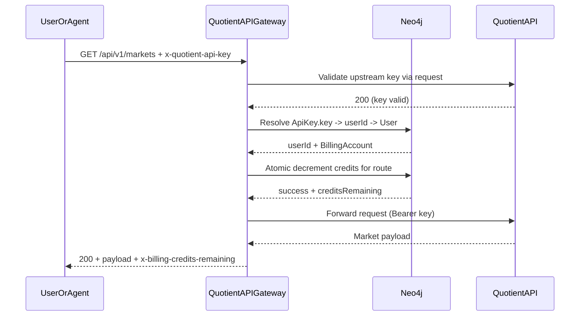
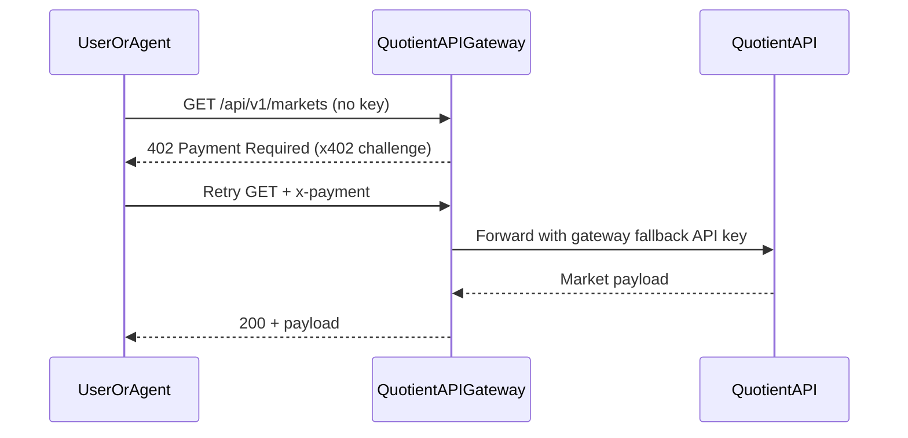
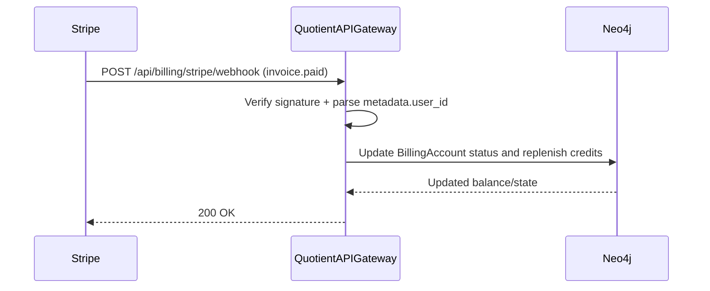

# Quotient API Gateway

x402-style monetization and policy gateway in front of `quotient-api`.

## What it does

- Returns `402 Payment Required` for protected routes when payment proof is missing.
- Accepts a local test payment token for phase-1 development.
- Proxies read endpoints (`/api/v1/markets*`) to Quotient API.
- Supports dual-path access:
  - pass-through user key via `x-quotient-api-key` with subscription-credit metering
  - x402 paid fallback via `x-payment` token when key is missing or out of credits
- Handles Stripe subscription webhook events at `/api/billing/stripe/webhook`.
- Serves a public gateway skill artifact at `/public/skills/quotient-api-gateway/SKILL.md`.

## Quickstart

```bash
cp .env.example .env
npm install
npm run build
node dist/server.js
```

Server starts at `http://localhost:8787` by default.

## Request Sequence Diagrams

### 1) Valid key + active credits



### 2) Missing key with x402 fallback



### 3) Stripe renewal replenishes credits



## Required environment variables

- `QUOTIENT_API_BASE_URL` (example: `https://api.quotient.co`)
- `QUOTIENT_API_KEY` (example: `qt_...`)
- `X402_TEST_TOKEN` (local payment token for testing)
- `BILLING_ENABLED`, `BILLING_PROVIDER_MODE`, `BILLING_INCLUDED_CREDITS`
- `BILLING_CREDIT_COST_MARKETS`, `BILLING_CREDIT_COST_INTELLIGENCE`, `BILLING_CREDIT_COST_SIGNALS`
- `BILLING_STORE_BACKEND` (`memory` or `neo4j`)
- `BILLING_MOCK_ACTIVE_USER_IDS` (optional, comma-separated canonical `User.id` values for mock mode)
- `STRIPE_SECRET_KEY`, `STRIPE_WEBHOOK_SECRET` (when `BILLING_PROVIDER_MODE=stripe`)
- `NEO4J_URI`, `NEO4J_USERNAME`, `NEO4J_PASSWORD` (required when `BILLING_STORE_BACKEND=neo4j`)

See `.env.example` for full list.

## Local E2E

Detailed instructions: `docs/local-e2e-testing.md`.

Quick run:

```bash
export X402_TEST_TOKEN=pay_local_test_token
# Optional: real user key to test subscription path
export QUOTIENT_USER_API_KEY=qt_your_real_key
# Optional: precomputed SHA256 of QUOTIENT_USER_API_KEY to force active subscription in mock mode
export BILLING_MOCK_ACTIVE_API_KEY_HASHES=<sha256_hash>
# For durable credit state:
# export BILLING_STORE_BACKEND=neo4j
bash scripts/e2e-local.sh
```

## Stripe Setup Runbook

See `docs/stripe-registration-runbook.md`.
