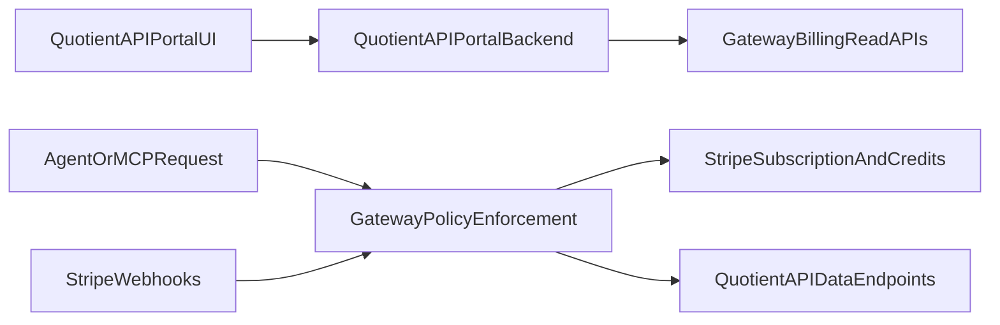

# Portal Integration Workstream (Future Execution)

This document describes how to integrate the existing `quotient-api` portal/dashboard UX with gateway-owned billing and metering.

## Goal

Keep billing enforcement and monetization policy in `quotient-api-gateway`, while allowing users to view billing/usage in the existing `quotient-api` dashboard.

## Ownership Boundary

- `quotient-api-gateway` owns:
  - Stripe registration and webhook handling
  - Subscription state and included-credit ledger
  - Route-level credit pricing logic
  - x402 fallback policy
- `quotient-api` portal owns:
  - Authenticated dashboard UX
  - Documentation pages
  - Display of usage/billing data from gateway read APIs

## Architecture (Target)



## Current Shipped vs Planned

- Shipped now:
  - `GET /api/billing/summary` (key-scoped billing summary)
  - `POST /api/billing/stripe/webhook`
- Planned in this document:
  - Portal-specific read APIs and service-auth model
  - Additional usage/pricing read endpoints

## Workstream Plan

### 1) Define Gateway Read APIs for Portal

Add authenticated, read-only endpoints in gateway for dashboard consumption.
These are planned and not all are implemented yet:

- `GET /api/billing/summary` (already shipped; currently keyed by `x-quotient-api-key`)
  - subscription status
  - current plan
  - credits included / credits remaining
  - billing cycle start/end
- `GET /api/portal/billing/usage` (planned)
  - usage events by period and endpoint
  - credits consumed by route
- `GET /api/portal/billing/pricing` (planned)
  - route-to-credit cost map
  - plan metadata (included credits, overage policy if applicable)

Notes:
- Keep response shapes stable and versioned.
- Include pagination for detailed usage endpoints.

### 2) Define Identity Mapping Contract

Decide and lock one user identity key shared by portal and gateway:

- preferred: Quotient user ID (`user_id`) derived from `qt_` API key records
- alternative: internal customer ID mapped in gateway

Contract requirement:
- every portal billing request must resolve to exactly one gateway billing account.

### 3) Add Secure Service-to-Service Auth

Portal backend should call gateway billing read endpoints with service credentials:

- use `Authorization: Bearer <internal_service_token>` or mTLS
- do not call read APIs directly from browser
- enforce least privilege (read-only scope for portal integration)

### 4) Implement Portal Data Adapters in `quotient-api`

In `quotient-api` portal backend:

- add gateway client module for billing endpoints
- normalize gateway payloads into portal view models
- handle partial failures gracefully (billing panel degraded, not full page failure)

### 5) Update Dashboard UX Sections

Add or update dashboard sections:

- Plan and status (active/past_due/canceled)
- Credits remaining and burn rate
- Endpoint usage breakdown (credits consumed by route)
- Next refill/renewal timing
- x402 fallback indicator (optional but useful)

### 6) Observability and Reconciliation

Add monitoring and consistency checks:

- compare gateway metering totals vs portal-displayed totals
- alert on drift, missing webhook processing, or delayed sync
- include request IDs for traceability from portal view to gateway events

## Data Contract Draft (Example)

`GET /api/billing/summary` (shipped)

```json
{
  "customer_id": "cus_123",
  "subscription_status": "active",
  "plan_id": "starter_20",
  "credits_included": 1000,
  "credits_remaining": 7420,
  "current_period_start": "2026-03-01T00:00:00Z",
  "current_period_end": "2026-04-01T00:00:00Z",
  "updated_at": "2026-03-08T12:34:56Z"
}
```

`GET /api/portal/billing/pricing` (planned)

```json
{
  "plan_id": "starter_20",
  "route_credit_costs": {
    "/api/v1/markets": 1,
    "/api/v1/markets/{slug}/intelligence": 2,
    "/api/v1/markets/{slug}/signals": 2
  }
}
```

## Execution Checklist

- [ ] Build gateway read APIs for portal billing data
- [ ] Lock identity mapping between portal users and gateway billing accounts
- [ ] Add service-to-service auth between `quotient-api` portal backend and gateway
- [ ] Implement portal gateway client and adapters
- [ ] Add dashboard sections for subscription + credits + usage
- [ ] Add reconciliation checks and logging
- [ ] Write E2E test flow for portal billing display consistency

## Risks and Mitigations

- Identity mismatch between portal and gateway
  - Mitigation: explicit mapping table and validation tests
- Dashboard stale data
  - Mitigation: cache with short TTL and refresh controls
- Billing UI outage affecting full portal page
  - Mitigation: isolate billing panel with graceful fallback state

## Out of Scope (For This Workstream)

- Moving billing enforcement into `quotient-api`
- Replacing x402 fallback policy
- Live trading execution features
